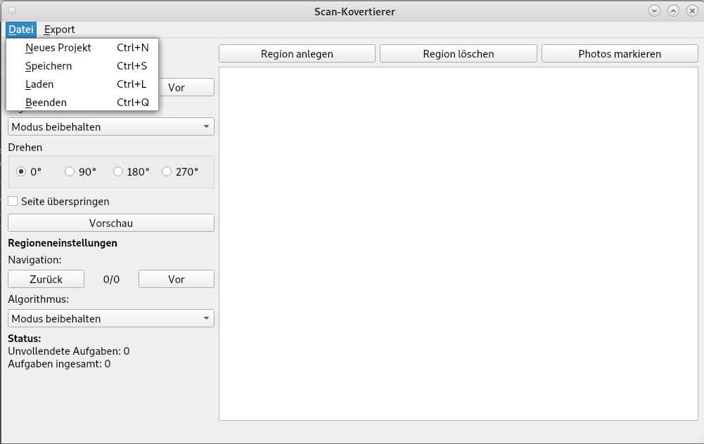
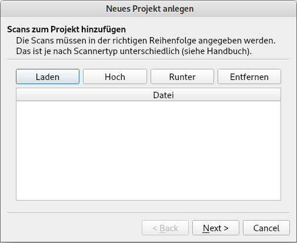
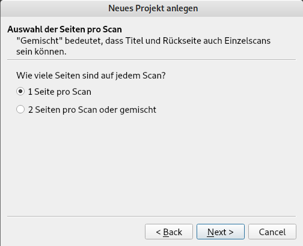
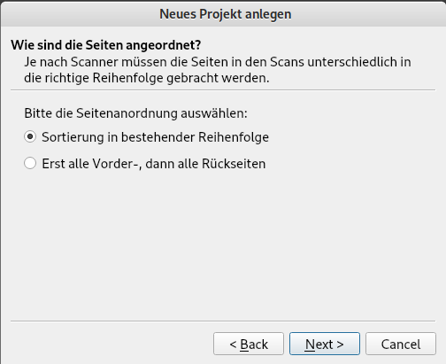
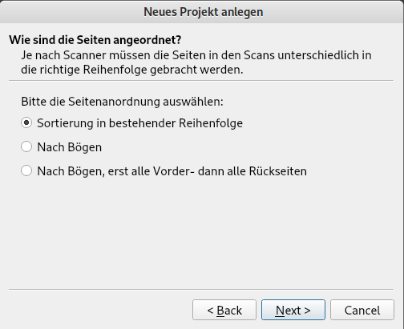
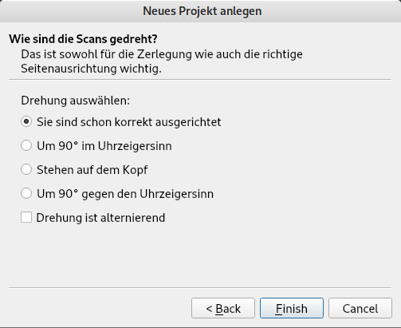

Quickstart
==========

Um Scans in archivkonforme Dateien zu verwandlen, muss zunächst ein
*Projekt* angelegt werden. Dazu gibt es im Datei-Menü den Unterpunkt
"Neues Projekt":

Beim Anlegen eines neuen Projektes öffnet sich dann ein Assistent
zum Einlesen der Scans für das Projekt. In diesem Assistent ist es
möglich, vor und zurück zu gehen, wenn er aber einmal abgeschlossen
ist, können keine weiteren Scans mehr zum Projekt hinzugefügt werden
und auch alle die anderen Angaben, die in diesem Assistenten gemacht
wurden, können nicht mehr geändert werden.

Der erste Bildschirm dient dazu, die Scans-Dateien festzulegen und
ihre Reihenfolge zu ordnen:

Der Button "Laden" kann beliebig oft genützt werden, um Dateien
hinzuzufügen, mit den Buttons "Hoch" und "Runter" kann die
Reihenfolge geändert werden und mit "Löschen", wer hätte es 
gedacht, lassen sich auch wieder Dateien aus der Liste entfernen.

Danach stellt der Assistent noch einige Fragen, die notwendig sind,
um die Seiten aus den Scans zu extrahieren. Bei der ersten
Frage geht es darum, wie viele Seiten auf einem Scan zu erwarten
sind:

Entweder handelt es sich um Einzelseiten oder um Doppelseiten (etwa
Zeitschriften- oder Broschüren-Scans). Bei Doppelseiten ist es auch
möglich, die Titel- bzw. Rückseite einzeln zu scannen, der Scan
Konvertierer prüft das dann selbständig.

Danach wird die Seitenanordnung abgefragt. Im Normalfall sind
Einzelseitenscans immer in der Reihenfolge,
wie sie dann im pdf erscheinen sollen - falls nicht, hat man auf
der ersten Dialogseite des Assistenten die Scans nicht richtig
angeordnet. Es gibt aber auch die Möglichkeit zu sagen, dass erst
alle Vorder- und dann alle Rückseiten kommen. Das ist ganz
nützlich, wenn man einen Einzugsscanner hat, der nicht in der
Lage ist, Vorder- und Rückseiten in einem Arbeitsgang zu scannen.
Dann kann man erst die Vorder- und danach die Rückseiten scannen
und dies hier angeben, dann muss man nicht beim Laden die Scans
in die richtige Reihenfolge bringen.

Komplizierter ist es bei doppelseitigen scans. Auch hier ist
natürlich der Standardfall, dass man die Seiten  schon richtig
angeordnet hat. Es gibt aber auch die Möglichkeit, bei einer
Broschüre oder Zeitschrift die Heftklammern zu entfernen und
die Blätter durch einen Einzugsscanner zu jagen. Dann sind
die Seiten nach Bögen verteilt, was man hier auswählen kann.
Oder man hat einen Einzugsscanner, der nicht gleichzeitig Vorder-
und Rückseite scannt, dann kann man auch angeben, dass erst
die ganzen Vorder- und dann die ganzen Rückseiten gescannt
wurden.

Die letzte notwendige Angabe ist, ob die Scans gedreht sind.
Hier muss angegeben werden, wie die Scans tatsächlich gedreht
sind, nicht welche Drehung auf sie angewendet werden soll.
Es gibt zusätzlich die Möglichkeit anzukreuzen, ob die Drehung
abwechselt - das ist typischerweise der Fall bei Einzugsscannern,
die Vorder- und Rückseite in einem Arbeitsgang scannen. Diese
Option sollte man nicht verwenden, wenn man erst alle Vorder-
und dann alle Rückseiten mit einem Einzuscanner erstellt. In
diesem Fall sollte man direkt beim Einlegen in den Einzug darauf
achten, dass alle Scans gleich ausgerichtet sind.

Schließt man nun den Dialog ab, werden einem die ganzen
Seite auf dem Hauptbildschirm angezeigt. Im Prinzip kann
man nun direkt die Seiten als pdf- oder tiff-Dateien 

